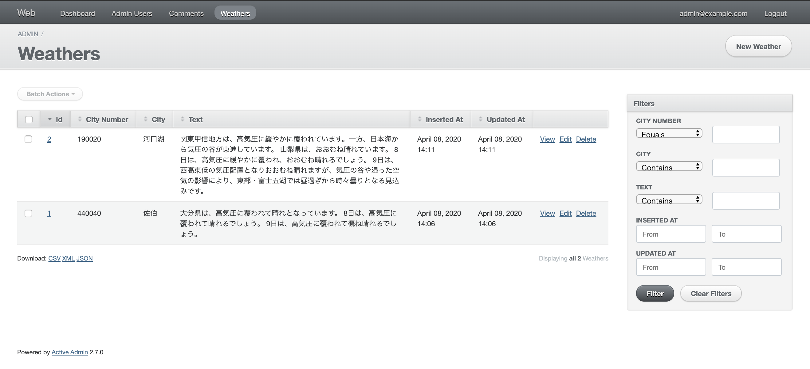

# Introduction
- I like to use [Elixir](https://elixir-lang.org/) to write programs.
    - `|>` is my favorite.
- I often use [Ruby on Rails](https://rubyonrails.org/) in my work, especially [ActiveAdmin](https://activeadmin.info/index.html).
    - With just a few lines, we can create a website administration with [CRUD](https://ja.wikipedia.org/wiki/CRUD).
- In this article we will do the following:
    - Use [Elixir](https://elixir-lang.org/) to periodically retrieve the weather data and save it to the database.
    - Use [ActiveAdmin](https://activeadmin.info/index.html) to create a website administration.



## Supplement
- Of course, you can use [Elixir](https://elixir-lang.org/) and [Phoenix](https://www.phoenixframework.org/) to create a website administration, or you can use [Ruby](https://www.ruby-lang.org/ja/) to create one.
- I can't say anything back when I'm told that, but I want to use [Elixir](https://elixir-lang.org/) anyway!
    - (Do you need a reason for what you like?) 
    - (Is it really something you like for all sorts of reasons?)
- Previously, I wrote an article called [Making Slack Workflow applications a CSV (with Elixir)](https://qiita.com/torifukukaiou/items/9db04591477de8c4cc11), in which I introduced a program that retrieves data that matches a certain condition from Slack and outputs it to a CSV file.
- I have developed an internal tool that can be saved to a database using [ecto](https://hexdocs.pm/ecto/Ecto.html) and listed using [ActiveAdmin](https://activeadmin.info/index.html).
- I've taken only the essence of this moment and put it together.

# Requirements
- [Elixir](https://elixir-lang.org/) 1.9.4
- [Ruby](https://www.ruby-lang.org/ja/) 2.6.3
    - A more recent version would probably be fine.
- PostgreSQL 12.1
    - This article assumes that you have a superuser account with a username of `postgres` and a password of `postgres`.
    - If you don't have this account set up on your machine, you can create it by typing `psql postgres` and typing the following command.
    - This is reprinted from an article in [Ecto](https://hexdocs.pm/phoenix/ecto.html#content).

```
postgres=# CREATE USER postgres;
postgres=# ALTER USER postgres PASSWORD 'postgres';
postgres=# ALTER USER postgres WITH SUPERUSER;
postgres=# \q
```


- [yarn](https://yarnpkg.com/)

Let's create a working directory and get started.

```
$ mkdir ecto_activeadmin
$ cd ecto_activeadmin
```

# Project using [ecto](https://hexdocs.pm/ecto/Ecto.html)([Elixir](https://elixir-lang.org/))

- Create our favorite [Elixir](https://elixir-lang.org/) program!
- [ecto](https://hexdocs.pm/ecto/Ecto.html) is a toolkit for data mapping and language integrated query for Elixir

```
$ mix new weathers --sup
```

- Modify `mix.exs` slightly.

```elixir:mix.exs
  defp deps do
    [
      {:ecto_sql, "~> 3.0"},
      {:postgrex, ">= 0.0.0"},
      {:lwwsx, "~> 0.1.1"}
    ]
  end
```

- Resolve the dependencies.
- [lwwsx](https://hex.pm/packages/lwwsx) is the [Hex](https://hex.pm/) that gets the weather forecast from Livedoor's [Weather Web Service](http://weather.livedoor.com/weather_hacks/webservice).

```
$ mix deps.get
```

- create `Weathers.Repo`
- Using this inserts on database.

```
$ mix ecto.gen.repo -r Weathers.Repo
```

- Modify `lib/weathers/application.ex` and register `Weathers.Repo` as a supervisor in the supervision tree.
    - I'm like [Lou Oshiba](https://ameblo.jp/lou-oshiba/), but I can only explain it like this (say I don't understand it...)
    - The story of why [Elixir] (https://elixir-lang.org/) is said to be so robust is profound!
    - Don't think, feeeel.

```elixir:lib/weathers/application.ex
  def start(_type, _args) do
    children = [
      Weathers.Repo
    ]
```

- Change `config/config.exs`.

```elixir:config/config.exs
config :weathers, Weathers.Repo,
  database: "weathers_repo",
  username: "postgres",
  password: "postgres",
  hostname: "localhost"

config :weathers,
  ecto_repos: [Weathers.Repo]
```

- Once you're done here, we'll create a database.

```
$ mix ecto.create
```

- We then create a migration file skeleton to create the table.

```
$ mix ecto.gen.migration create_weathers
```

- The migration file should contain the following:

```elixir:priv/repo/migrations/20200408123754_create_weathers.exs
defmodule Weathers.Repo.Migrations.CreateWeathers do
  use Ecto.Migration

  def change do
    create table(:weathers) do
      add :city_number, :integer, null: false
      add :city, :string, null: false
      add :text, :text, null: false

      timestamps()
    end
  end
end
```

- Create the `lib/weathers/weather.ex` as follows:
- Feel!

```elixir:lib/weathers/weather.ex
defmodule Weathers.Weather do
  use Ecto.Schema
  import Ecto.Changeset

  schema "weathers" do
    field :city_number, :integer
    field :city, :string
    field :text, :string

    timestamps()
  end

  def changeset(weather, attrs) do
    weather
    |> cast(attrs, [:city_number, :city, :text])
    |> validate_required([:city_number, :city, :text])
  end
end
```

- Create `lib/weathers/worker.ex`.
- Every 1000 * 60 * 60 seconds `Weathers.Worker.handle_info` is called and `Weathers.Worker.run` is executed.
- Worker.run` gets the weather forecast data of an arbitrary point and saves it in the database.

```elixir:lib/weathers/worker.ex
defmodule Weathers.Worker do
  use GenServer

  def start_link(initial_val) do
    GenServer.start_link(__MODULE__, initial_val, name: __MODULE__)
  end

  def init(initial_val) do
    Process.send_after(__MODULE__, :tick, 1000)
    {:ok, initial_val}
  end

  def handle_info(:tick, state) do
    spawn(Weathers.Worker, :run, [])
    Process.send_after(__MODULE__, :tick, 1000 * 60 * 60)

    {:noreply, state}
  end

  def run do
    {city_number, city} = Lwwsx.cities() |> Enum.random()
    {:ok, text} = Lwwsx.current_text(city_number)

    Weathers.Repo.insert(
      Weathers.Weather.changeset(%Weathers.Weather{}, %{city_number: city_number, city: city, text: text})
    )
  end
end
```

- Also, like [Lou Oshiba](https://ameblo.jp/lou-oshiba/), modify `lib/weathers/application.ex` to register `Weathers.Worker` as a supervisor in the supervision tree.

```elixir:lib/weathers/application.ex
  def start(_type, _args) do
    children = [
      Weathers.Repo,
      Weathers.Worker
    ]
```

- ok

```
$ iex -S mix
```

- If we leave it like this, we'll get weather data once an hour.
- What do you think?
- **Beautiful！**

# Project using [ActiveAdmin](https://activeadmin.info/index.html)([Ruby on Rails](https://rubyonrails.org/))

- Create elegant backends for website administration.

```
$ pwd
/hoge/ecto_activeadmin/weathers
$ cd ..
$ mkdir web
$ bundle init
```

- Edit `Gemfile`:

```:Gemfile
gem "rails"
```

- Create a project of [Ruby on Rails](https://rubyonrails.org/) after `bundle install`.

```
$ bundle install --path vendor/bundle
$ bundle exec rails new . -d postgresql
```

- Change the configuration of `config/database.yml` so that it can connect to the database.

```:config/database.yml
default: &default
  adapter: postgresql
  encoding: unicode
  pool: <%= ENV.fetch("RAILS_MAX_THREADS") { 5 } %>
  username: postgres
  password: postgres

development:
  <<: *default
  database: weathers_repo

test:
  <<: *default
  database: web_test

production:
  <<: *default
  database: web_production
  username: web
  password: <%= ENV['WEB_DATABASE_PASSWORD'] %>
```

- First, dump the database schema created in the project using [Elixir](https://elixir-lang.org/)

```
$ bundle exec rails db:schema:dump
```

- Then, `db/schema.rb` should look like this:

```ruby:db/schema.rb
ActiveRecord::Schema.define(version: 2020_04_08_123754) do

  # These are extensions that must be enabled in order to support this database
  enable_extension "plpgsql"

  create_table "weathers", force: :cascade do |t|
    t.integer "city_number", null: false
    t.string "city", limit: 255, null: false
    t.text "text", null: false
    t.datetime "inserted_at", precision: 0, null: false
    t.datetime "updated_at", precision: 0, null: false
  end

end
```

- Great!
- Then change the `Gemfile` to add [ActiveAdmin](https://activeadmin.info/index.html).

```:Gemfile
gem 'activeadmin'
gem 'devise'
gem 'cancancan'
gem 'draper'
gem 'pundit'
```

- After `bundle install`, set up [ActiveAdmin](https://activeadmin.info/index.html), migrate the database, and input seed data as follows:

```
$ bundle install
$ bundle exec rails g active_admin:install
$ bundle exec rails db:migrate
$ bundle exec rails db:seed
```

- There are many steps to go through so far, but not a single line of code.
- It takes time and effort to prepare for anything.
- Then, we'll finally add the code to the [Ruby on Rails](https://rubyonrails.org/) project.

```ruby:app/models/weather.rb
# app/models/weather.rb
class Weather < ApplicationRecord; end
```

```ruby:app/admin/weathers.rb
# app/admin/weathers.rb
ActiveAdmin.register Weather do
  permit_params :city_number, :city, :text, :inserted_at
end
```

- That's all.
- **You only need to make this and these two files!**
- Highlights of this article.
- Now, let's start Rails.

```
$ bundle exec rails s 
```

- Visit http://localhost:3000/admin/
- Please enter the following information on the login screen.

```
User: admin@example.com
Password: password
```


Yay!

# Wrapping Up
- [Elixir](https://elixir-lang.org/) is a beautiful and fun language to write in!
    - That's how interesting programming was!　It makes me realize once again that I'm not the only one.
    - [Elixir](https://elixir-lang.org/) is the beautifulest language I've ever met.
- If you create a database schema other than [Ruby on Rails](https://rubyonrails.org/), use `rails db:schema:dump` to reflect it in db/schema.rb.
- Using [ActiveAdmin](https://activeadmin.info/index.html), you can complete a website administration with [CRUD](https://ja.wikipedia.org/wiki/CRUD) in just a few lines.
